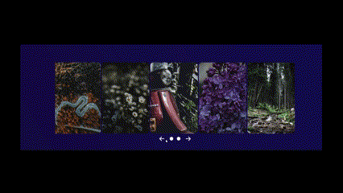

# Slider-css

Slider-css, HTML ve CSS kullanılarak oluşturulmuş hafif ve duyarlı bir resim kaydırıcısıdır.

## Önizleme



## Özellikler

- Farklı ekran boyutları için duyarlı tasarım
- Resimleri yatay olarak kaydırma
- Önceki ve sonraki düğmeleri ile resim gezinme
- Çekici bir görsel efekt için gradient arka plan

## Kurulum

1. Depoyu klonlayın:

   ```bash
   git clone https://github.com/jidely/Slider-css.git

##
# Slider-css

Slider-css is a lightweight and responsive image slider built using HTML and CSS.

## Preview


## Features

- Responsive design for various screen sizes
- Horizontal scrolling of images
- Previous and next buttons for image navigation
- Gradient background for an appealing visual effect

## Installation

1. Clone the repository:

   ```bash
   git clone https://github.com/jidely/Slider-css.git
